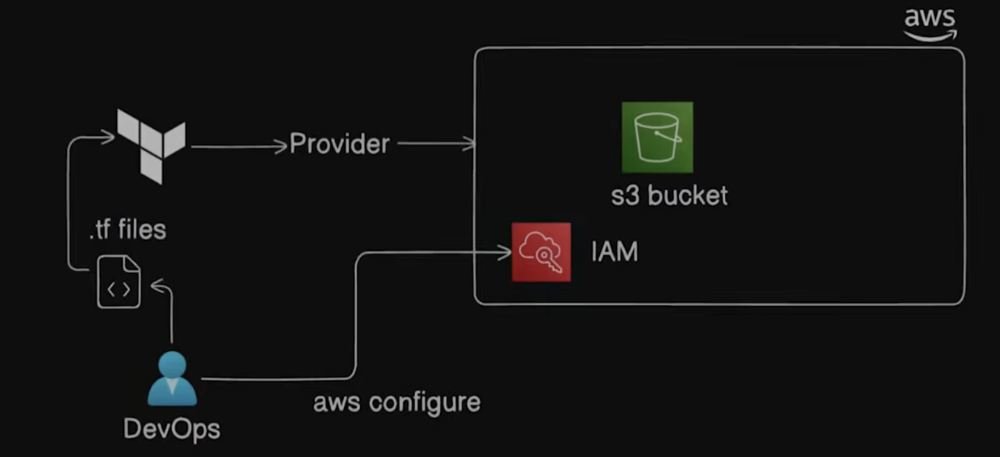

## Learning S3 bucket



## How to provision S3 bucket

```terraform
resource "aws_s3_bucket" "demo_bucket" {
  bucket = "my-bucket" # bucket name
  tags = {
        Name = "My Bucket"
        Environment = "Dev"
  }
}
```
## Procedure
- Initialize Terraform using tf init
- Run Terraform Plan, shows the resources to be created, dry run
- tf apply
- update comparisons happen with the help of state file
- tf destroy