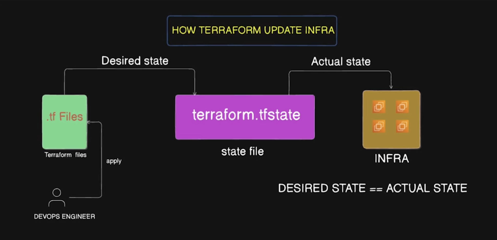

## What is tf state file and remote backend? 



- Compares Desired State with Actual State
- State file shows the state of the actual infra
- all info is stored in state file
- We store state file remotely in S3 backend.
- we do not update/delete file manually
- Use state locking, multiple users cannot use same state file in the same infra at the same time.
- Why DynamoDB was deprecated? 
- Bucket should already exist
- tf state list -> what resource state file has

``` terraform
terraform {
    backend "s3" {
        bucket = "mybucket"
        key = "dev/terraform.tfstate"
        region = "us-west-1"
        encrypt = true
        use_lock_file = true
    }
}
```