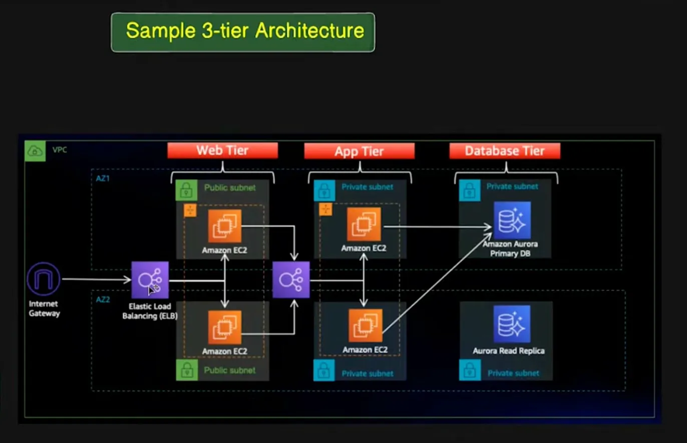
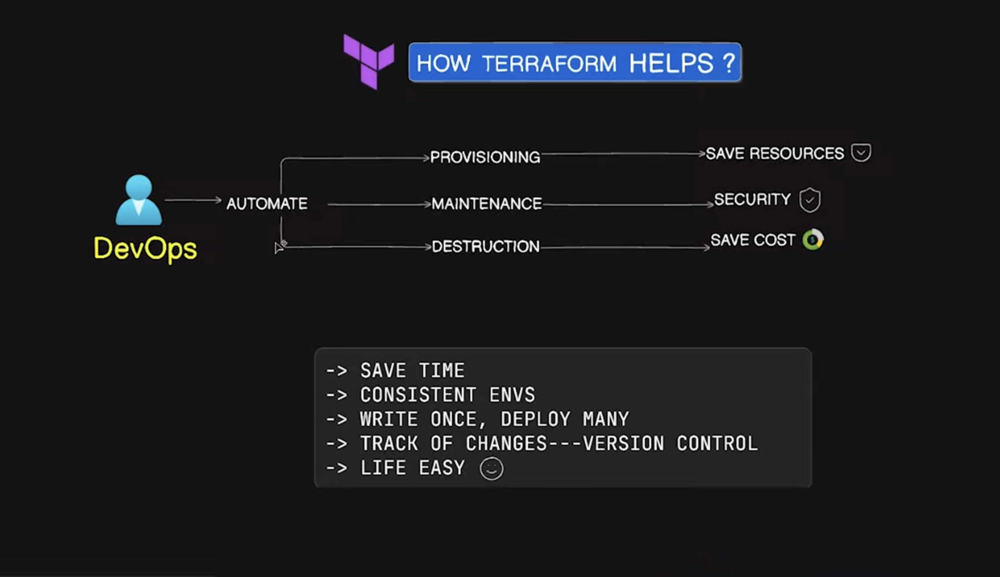
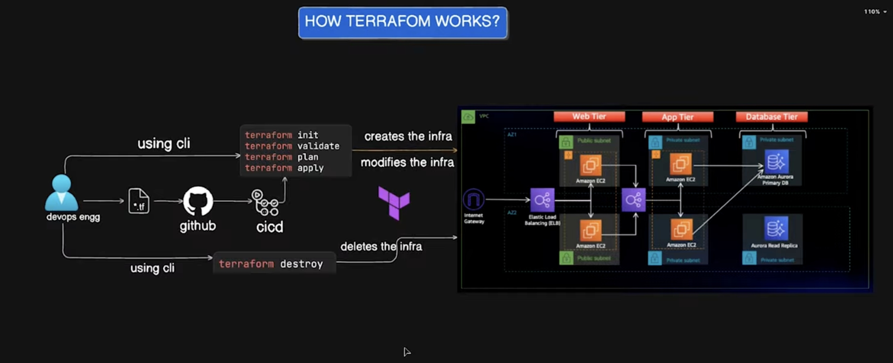

# Infra As Code

- Writing code to provision infra is called, IaC. 

## Tools for Infra

- Terraform
- Pulumi
- Azure ARM | Bicep (Azure only)
- AWS Cloud Formation, AWS CDK, 
SAM (AWS Only)
- Deployment Manager, Config Controller/Connector (GCP only)

## Topics to Learn

- VPC — create one with 2 AZs
- Subnets — 2 public (Web), 4 private (App + DB)
- Internet Gateway — attach to VPC
- NAT Gateway — for private subnet outbound - traffic
- EC2 instances — for Web and App tiers
- Application Load Balancer — to distribute - traffic
- Aurora — with a Primary + Read Replica
- CDN (CF)
- Health Probs
- Auto Scaling
- DB Servers (RDS), Replica Sets
- Route 53

## Concepts to Learn
- What happens in Enterprise Level
- Multiple ENV for differnet purposes

## Challenges 
- Time
- People
- Cost
- Repetitive
- Human Errors
- Insecure
- It works on my machine

## Solution

## Benefits

- Everything is commited to version control

## How it works on High Level

## Terraform Providers
- what does Random mean?

## Working Procedure

- make sure aws cli installed
- auth and author first
- create access key via user, IAM
- user should have access to manage res
- Start with provider.tf 
- block version for compatibility issues
- conf provider like aws
- any resource
- refer to doc for writing code